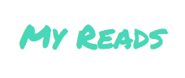

# My Reads &middot; []

This is a personal library project for Udacity's React Fundamentals course. It control books into specific shelves - Currently Reading, Want to Read and Read.

## Installing / Getting started

$ npm install

$ npm start

It wiil install all node modules and start the project ate localhost:3000

## Developing

### Built With

React, react-strap, bootstrap, etc

### Deploying / Publishing

$ npm run build

To run release version localy it is necessary to start a server. You can user serve -s build.

## Licensing

It is just a academical project. Use it whatever you want.
